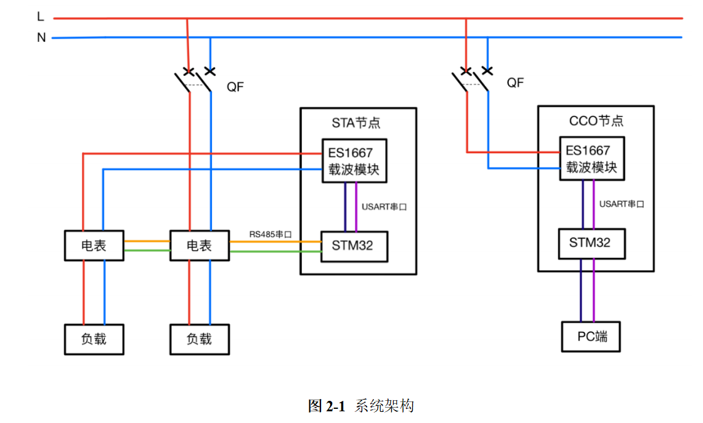
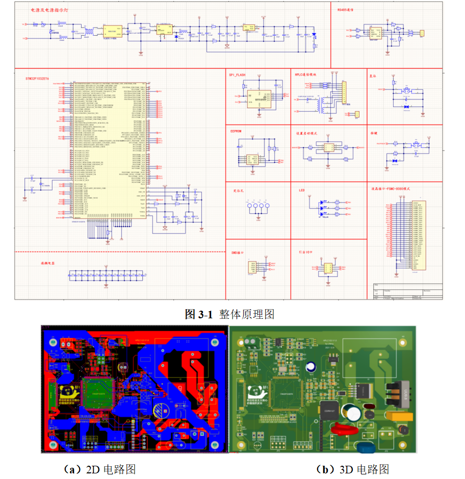

# 基于HPLC通信的电力监测系统设计

## 前言

* 本项目来源于毕业设计，如有引用请标明出处
* 项目完成情况请参考video
* 如有疑问可以邮件咨询
* 以下内容部分来自于毕设文档，做了适当删减可能会有一些不连贯

## 文档结构

* code：代码分为两部分一部分为qt上位机，一部分为载波通信单元（基于stm32f1）
* doc：包含相关协议文档
* video：项目完成情况的视频讲解
* PCB：PCB原理图

## 摘要

目前我国低压台区存在测量点覆盖率较低、网络拓扑结构复杂、设备分散性较大、通讯可靠性较低，无法按照中高压电网数字化的模式实现全范围监测等问题。已有的窄带电力线载波通信技术标准在国内复杂的信道环境中很难达到稳定通信的需求。因此IEEE1901.1-2018中提出了一种适用于我国智能电网的中频带电力线载波通信技术标准，其噪声低且相对稳定，信道质量好，有利于载波采集单元上数据的传输。

本文分析了场域网络中常用的物联网末端设备接入技术的特点，根据低压台区的监测需求，设计基于HPLC通信的电力监测系统，依托PLC-Iof、云化管理+边缘计算、信号处理、智能融合终端、大数据等技术，进行低压台区电力监测系统体系架构实现、低压台区传感检测与通信控制一体化开发，实现对低压台区的运行状态智能感知、网损动态分析、故障识别等功能。

本文完成了载波通信单元的相关软硬件设计，制定了私有通信协议，完成了QT平台下的客户端环境搭建。通过适配DL/T-645电表规约和ES1667-NC载波模块接口协议，实现了监测系统内电力线路相关运行参数的采集、上报、显示和分析。最后，本文搭建了小型电力监测系统测试环境，进行了载波通信单元之间的组网测试、自适应获取电表通讯地址功能测试、客户端收集、显示和分析监测系统内电力线运行相关参数的测试。测试结果显示，本文设计的基于HPLC通信的电力监测系统可以满足低压台区的监测需求。

 

关键词：载波通信单元，电力监测系统，HPLC，云化管理+边缘计算，大数据

## 总体方案设计

电力监测系统对低压台区电力网络实现监控、分析、预警等功能。系统架构如图2-1所示，本系统由STA节点、CCO节点、客户端以及数据库四部分组成，每个用户安装一台智能电表，一个STA节点可以连接多台电表，一个系统内安装一个CCO节点。电表负责采集线路运行的相关参数，如电压、电流、功率因数等。STA节点与电表通过RS485串口进行通信，定时对电表的采集到的数据进行收集、存储和分析，同时在CCO节点通过ES1667-NC载波模块请求数据的时候上报对应数据，异步运行以提高系统效率。CCO节点将接收到的数据通过串口发送到客户端，客户端将数据进行分析处理后存储在数据库，同时将系统运行相关参数显示给用户，用户可通过人机交互界面对低压台区实现监控。因传输的数据包含住户的个人信息，在数据传输过程中将数据通过AES对称加密进行处理

## 载波通信单元的硬件设计

电力监测系统中的STA节点和CCO节点统称为载波通信单元，它们共用一套硬件设计。载波通信单元主要负责与智能电表通讯，获取线路运行的相关参数。监测系统中的CCO节点汇总STA节点收集到的数据，并上报客户端。

本设计采用Altium Designer 2021绘制，主控芯片采用STM32F103ZET6，设计相应的电源供电电路、SRAM和串行FLASH电路、RS485通讯电路、ES1667-NC载波模块的接口电路等[18]。整体原理图如图3-1所示，PCB电路板如图3-2所示

## 结论

经过调试验证，基于HPLC通信的电力监测系统可以稳定地运行，且满足了低压台区的监测需求。本文所做的主要工作如下。

（1）分析了场域网络中常用的物联网末端设备接入技术的特点，根据低压台区的监测需求，提出了基于HPLC通信的电力监测系统的设计方案。

（2）完成了载波通信单元的原理图设计，PCB电路板的绘制，打样以及焊接调试。

（3）完成了载波通信单元的软件的需求分析，概要设计，详细设计，编码以及测试。制定了私有通信协议，规范了HPLC网络中的数据传输格式。完成了QT平台下客户端环境的搭建，实现了实时监测和阈值报警等功能。

本设计采用HPLC通信技术完成了电力监测系统的设计并实现了相应的功能，但是因为测试环境的搭建工作量较大以及时间和成本有限，本设计仍存在一定的不足。

（1）因为考虑到时间和成本因素，电力监测系统搭建的测试环境较小，只有三个载波通信单元和四台智能电表。没有适配低压台区较多住户量的场景需求，下一步可以通过优化数据传输方案，以满足大容量场景下的应用。

（2）该系统目前还处于实验室阶段，没有很好地优化软硬件以降低成本，提高复杂环境下设备的使用寿命。软件没有很好地适配极端环境下的通信的情况，使用自适应获取电表通讯地址的功能时，RS485总线上挂载的电表的数量上限为3台，需要对软硬件设计进行进一步的优化。

（3）因为搭建的测试环境较小，导致收集到的线路运行参数太少，很难通过大数据和神经网络等技术对系统异常进行分析和预测。下一步可通过与断路器等电力设备相结合，实现故障识别和系统快速自愈的功能，为低压台区实现高可靠供电提供技术支撑。

 